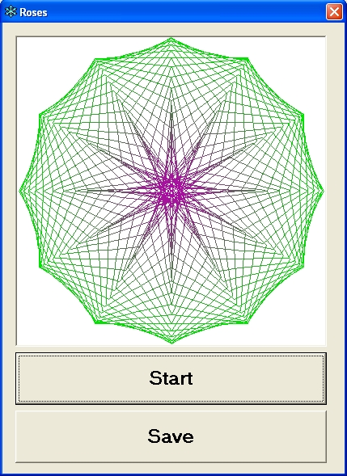



## Roses

### Description

This program creates a really cool flower effect. Just click the start button and it creates a random flower. You can then click to save it as a bitmap. It also does a really nice gradient effect. Please vote!
 
### More Info
 

             |
---                |---
**Submitted On**   |2004-06-08 23:42:22
**By**             |[SixLetter](https://github.com/Planet-Source-Code/PSCIndex/blob/master/ByAuthor/sixletter.md)
**Level**          |Beginner
**User Rating**    |5.0 (20 globes from 4 users)
**Compatibility**  |VB 6\.0
**Category**       |[Miscellaneous](https://github.com/Planet-Source-Code/PSCIndex/blob/master/ByCategory/miscellaneous__1-1.md)
**World**          |[Visual Basic](https://github.com/Planet-Source-Code/PSCIndex/blob/master/ByWorld/visual-basic.md)
**Archive File**   |[Roses175530682004\.zip](https://github.com/Planet-Source-Code/sixletter-roses__1-54272/archive/master.zip)

